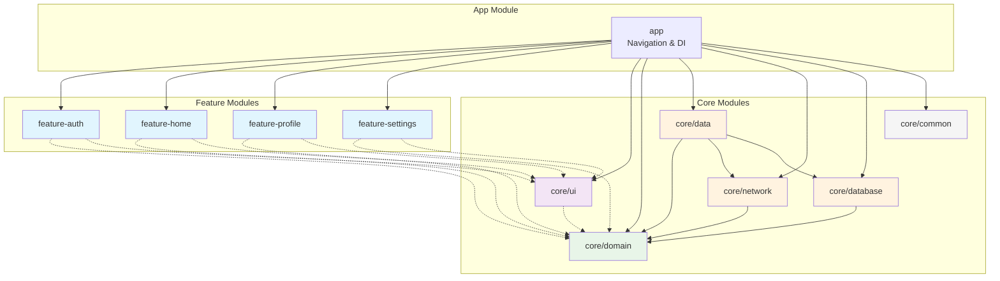

# Modularization Guide

Based on the modern Android multi-module architecture with Navigation3, Jetpack Compose, and strict dependency rules.

## Table of Contents
1. [Benefits](#benefits)
2. [Module Types](#module-types)
3. [Module Structure](#module-structure)
4. [Dependency Rules](#dependency-rules)
5. [Creating Modules](#creating-modules)
6. [Navigation Coordination](#navigation-coordination)
7. [Build Configuration](#build-configuration)

## Benefits

- **Scalability**: Changes in one module don't cascade to others
- **Parallel development**: Teams work independently on different features
- **Build speed**: Incremental builds only recompile changed modules
- **Reusability**: Core modules can be shared across apps
- **Encapsulation**: Clear boundaries and visibility controls
- **Testability**: Each module can be tested in isolation
- **Feature Independence**: Features don't depend on each other
- **Navigation Centralization**: App module coordinates all navigation
- **Adaptive UI Support**: Navigation3 enables responsive designs across form factors

## Module Types

### App Module (`app/`)
Entry point that brings everything together with Navigation3 adaptive navigation.

**Contains**:
- `MainActivity` with `NavigationSuiteScaffold`
- `AppNavigation` composable with `windowAdaptiveInfo`
- `NavHost` with all feature graphs
- `Navigator` implementations for feature coordination
- Hilt DI setup and component

**Dependencies**: All feature modules, all core modules

### Feature Modules (`feature/*`)
Self-contained features with clear boundaries and no inter-feature dependencies.

```
feature-auth/
├── build.gradle.kts
├── src/main/
│   ├── kotlin/com/example/feature/auth/
│   │   ├── presentation/              # UI Layer
│   │   │   ├── AuthScreen.kt          # Main composable
│   │   │   ├── AuthRoute.kt           # Navigation setup
│   │   │   ├── viewmodel/             
│   │   │   │   ├── AuthViewModel.kt   # State holder
│   │   │   │   ├── AuthUiState.kt     # UI state models
│   │   │   │   └── AuthActions.kt     # User actions
│   │   │   └── components/            # Smaller UI components
│   │   ├── navigation/                # Navigation Layer
│   │   │   ├── AuthDestination.kt     # Feature routes
│   │   │   ├── AuthNavigator.kt       # Navigation interface
│   │   │   └── AuthGraph.kt           # NavGraphBuilder extension
│   │   └── domain/                    # Optional: Feature-specific domain
│   │       ├── repository/
│   │       └── usecase/
│   └── res/                          # Feature resources
```

### Core Modules (`core/`)
Shared library code used across features with strict dependency direction.

| Module           | Purpose                                         | Dependencies                                        | Key Classes                                                                            |
|------------------|-------------------------------------------------|-----------------------------------------------------|----------------------------------------------------------------------------------------|
| `core:domain`    | Domain models, use cases, repository interfaces | None (pure Kotlin)                                  | `Topic`, `UserNewsResource`, `GetUserNewsResourcesUseCase`, `NewsRepository` interface |
| `core:data`      | Repository implementations, data coordination   | `core:domain`                                       | `OfflineFirstTopicsRepository`, `UserDataRepositoryImpl`                               |
| `core:database`  | Room database, DAOs, entities                   | `core:model` (if separate), otherwise `core:domain` | `MyDatabase`, `TopicDao`, `TopicEntity`                                                |
| `core:network`   | Retrofit API, network models                    | `core:model` (if separate), otherwise `core:domain` | `RetrofitNetwork`, `NetworkTopic`                                                      |
| `core:datastore` | Proto DataStore preferences                     | None                                                | `UserPreferencesDataSource`                                                            |
| `core:common`    | Shared utilities, extensions                    | None                                                | `AppDispatchers`, `ResultExtensions`                                                   |
| `core:ui`        | Reusable UI components, themes, base ViewModels | `core:domain` (optional)                            | `NewsResourceCard`, `MyTheme`, `BaseViewModel`                                         |
| `core:testing`   | Test utilities, test doubles                    | Depends on module being tested                      | `TestDispatcherRule`, `FakeRepository`                                                 |

## Module Structure

### Complete Project Structure

```
app/                    # App module - navigation, DI setup, app entry point
feature/
  ├── feature-auth/     # Authentication feature
  ├── feature-home/     # Home screen feature
  ├── feature-profile/  # User profile feature
  ├── feature-settings/ # App settings feature
  └── feature-<name>/   # Additional features...
core/
  ├── domain/           # Pure Kotlin: Use Cases, Repository interfaces, Domain models
  ├── data/             # Data layer: Repository impl, DataSources, Data models
  ├── ui/               # Shared UI components, themes, base ViewModels
  ├── network/          # Retrofit, API models, network utilities
  ├── database/         # Room DAOs, entities, migrations
  ├── datastore/        # Preferences storage
  ├── common/           # Shared utilities, extensions
  └── testing/          # Test utilities, test doubles
build-logic/            # Convention plugins for consistent builds
├── convention/
│   ├── src/main/kotlin/
│   │   ├── AndroidApplicationConventionPlugin.kt # App module
│   │   ├── AndroidLibraryConventionPlugin.kt     # Core library modules
│   │   ├── AndroidFeatureConventionPlugin.kt     # Feature modules
│   │   ├── AndroidComposeConventionPlugin.kt     # Compose setup
│   │   └── AndroidHiltConventionPlugin.kt        # Hilt setup
│   └── build.gradle.kts
```

### Feature Module Structure

```
feature-home/
├── build.gradle.kts
├── src/main/
│   ├── kotlin/com/example/feature/home/
│   │   ├── presentation/              # Presentation Layer
│   │   │   ├── HomeScreen.kt          # Main composable
│   │   │   ├── HomeRoute.kt           # Feature route composable
│   │   │   ├── viewmodel/             
│   │   │   │   ├── HomeViewModel.kt   # State holder
│   │   │   │   ├── HomeUiState.kt     # UI state models
│   │   │   │   └── HomeActions.kt     # User actions
│   │   │   └── components/            # Feature-specific UI components
│   │   │       ├── NewsResourceCard.kt
│   │   │       └── HomeTopBar.kt
│   │   ├── navigation/                # Navigation Layer
│   │   │   ├── HomeDestination.kt     # Feature routes (sealed class)
│   │   │   ├── HomeNavigator.kt       # Navigation interface
│   │   │   └── HomeGraph.kt           # NavGraphBuilder extension
│   │   └── di/                        # Feature-specific DI
│   │       └── HomeModule.kt          # Hilt module
│   └── res/                          # Feature resources
│       ├── drawable/
│       └── values/
└── src/test/                         # Feature tests
    └── kotlin/com/example/feature/home/
        ├── presentation/viewmodel/
        │   └── HomeViewModelTest.kt
        └── navigation/
            └── HomeDestinationTest.kt
```

### Core Module Structure

```
core/domain/
├── build.gradle.kts
├── src/main/kotlin/com/example/core/domain/
│   ├── model/                         # Domain models
│   │   ├── Topic.kt
│   │   ├── NewsResource.kt
│   │   └── UserNewsResource.kt
│   ├── repository/                    # Repository interfaces
│   │   ├── TopicsRepository.kt
│   │   ├── NewsRepository.kt
│   │   └── UserDataRepository.kt
│   ├── usecase/                       # Use cases
│   │   ├── GetUserNewsResourcesUseCase.kt
│   │   ├── BookmarkNewsUseCase.kt
│   │   └── GetTopicsUseCase.kt
│   └── di/                           # Domain DI (if needed)
│       └── DomainModule.kt
└── src/test/kotlin/com/example/core/domain/
    ├── model/
    └── usecase/
```

## Dependency Rules

### Allowed Dependencies

```
feature/* → core/domain → core/data
    ↓                       ↓
core/ui (optional)       (no circular dependencies)

app → all feature modules (for navigation coordination)
app → all core modules (for DI setup)

NO feature-to-feature dependencies allowed
```

### Strict Rules:
1. **Feature modules can only depend on Core modules**
2. **Feature modules cannot depend on other feature modules**
3. **Core/Domain has no Android dependencies** (pure Kotlin)
4. **Core/Data depends on Core/Domain** (implements interfaces)
5. **Core/UI is optional** for features that need shared UI components
6. **App module depends on all features** for navigation coordination
7. **No circular dependencies** between any modules

### Visual Dependency Graph



## Creating Modules

### 1. Create Feature Module

**Step 1: Create directory structure**
```
mkdir -p feature-auth/src/main/kotlin/com/example/feature/auth/{presentation/{viewmodel,components},navigation,di}
mkdir -p feature-auth/src/test/kotlin/com/example/feature/auth
```

**Step 2: Configure build.gradle.kts**
```kotlin
// feature-auth/build.gradle.kts
plugins {
    id("com.example.android.feature")
    id("com.example.android.compose")
    id("dagger.hilt.android.plugin")
    kotlin("kapt")
}

android {
    namespace = "com.example.feature.auth"
}

dependencies {
    // Core dependencies
    implementation(project(":core:domain"))
    implementation(project(":core:ui"))
    
    // AndroidX dependencies
    implementation(libs.androidx.compose.bom)
    implementation(libs.androidx.lifecycle.viewmodel.compose)
    implementation(libs.bundles.navigation3)
    
    // DI
    implementation(libs.hilt.android)
    kapt(libs.hilt.compiler)
    
    // Testing
    testImplementation(project(":core:testing"))
    testImplementation(libs.junit)
    testImplementation(libs.kotlinx.coroutines.test)
    testImplementation(libs.turbine)
}
```

**Step 3: Register in settings.gradle.kts**
```kotlin
include(":feature-auth")
```

**Step 4: Create navigation components**
```kotlin
// feature-auth/navigation/AuthDestination.kt
sealed class AuthDestination(val route: String) {
    object Login : AuthDestination("auth/login")
    object Register : AuthDestination("auth/register")
    object ForgotPassword : AuthDestination("auth/forgot_password")
    
    object Profile : AuthDestination("auth/profile/{userId}") {
        fun createRoute(userId: String) = "auth/profile/$userId"
    }
    
    companion object {
        fun fromRoute(route: String?): AuthDestination? {
            return when {
                route?.startsWith("auth/profile/") == true -> Profile
                route == Login.route -> Login
                route == Register.route -> Register
                route == ForgotPassword.route -> ForgotPassword
                else -> null
            }
        }
    }
}

// feature-auth/navigation/AuthNavigator.kt
interface AuthNavigator {
    fun navigateToRegister()
    fun navigateToForgotPassword()
    fun navigateBack()
    fun navigateToHome()
    fun navigateToProfile(userId: String)
    fun navigateToMainApp()
}

// feature-auth/navigation/AuthGraph.kt
fun NavGraphBuilder.authGraph(
    authNavigator: AuthNavigator,
    startDestination: String = AuthDestination.Login.route
) {
    composable(route = AuthDestination.Login.route) {
        LoginScreen(
            onLoginSuccess = { user ->
                authNavigator.navigateToMainApp()
            },
            onRegisterClick = {
                authNavigator.navigateToRegister()
            },
            onForgotPasswordClick = {
                authNavigator.navigateToForgotPassword()
            }
        )
    }
    
    composable(route = AuthDestination.Register.route) {
        RegisterScreen(
            onRegisterSuccess = { user ->
                authNavigator.navigateToMainApp()
            },
            onNavigateToLogin = {
                authNavigator.navigateBack()
            }
        )
    }
    
    composable(route = AuthDestination.ForgotPassword.route) {
        ForgotPasswordScreen(
            onResetSuccess = {
                authNavigator.navigateBack()
            },
            onNavigateBack = {
                authNavigator.navigateBack()
            }
        )
    }
}
```

### 2. Create Core Module

**Step 1: Create directory structure**
```
mkdir -p core/domain/src/main/kotlin/com/example/core/domain/{model,repository,usecase}
mkdir -p core/domain/src/test/kotlin/com/example/core/domain
```

**Step 2: Configure build.gradle.kts**
```kotlin
// core/domain/build.gradle.kts
plugins {
    id("com.example.android.library")
    kotlin("plugin.serialization")
}

android {
    namespace = "com.example.core.domain"
    
    buildFeatures {
        buildConfig = true
    }
}

dependencies {
    // Pure Kotlin - no Android dependencies
    implementation(libs.kotlinx.coroutines.core)
    implementation(libs.kotlinx.serialization.json)
    
    // Testing
    testImplementation(libs.junit)
    testImplementation(libs.kotlinx.coroutines.test)
    testImplementation(libs.turbine)
}
```

**Step 3: Create domain models**
```kotlin
// core/domain/model/Topic.kt
data class Topic(
    val id: String,
    val name: String,
    val description: String,
    val imageUrl: String?,
    val createdAt: Instant,
    val updatedAt: Instant
)

// core/domain/repository/TopicsRepository.kt
interface TopicsRepository {
    fun getTopics(): Flow<List<Topic>>
    fun getTopic(id: String): Flow<Topic>
    suspend fun refreshTopics(): Result<Unit>
    suspend fun syncWith(synchronizer: Synchronizer): Boolean
}

// core/domain/usecase/GetTopicsUseCase.kt
class GetTopicsUseCase @Inject constructor(
    private val topicsRepository: TopicsRepository
) {
    operator fun invoke(): Flow<List<Topic>> =
        topicsRepository.getTopics()
            .map { topics ->
                topics.sortedBy { it.name }
            }
}
```

### 3. Create App Module Configuration

**Step 1: Configure app module dependencies**
```kotlin
// app/build.gradle.kts
plugins {
    id("com.example.android.application")
    id("com.example.android.compose")
    id("dagger.hilt.android.plugin")
    kotlin("kapt")
}

android {
    namespace = "com.example.app"
    
    defaultConfig {
        applicationId = "com.example.app"
        versionCode = 1
        versionName = "1.0"
    }
}

dependencies {
    // Feature modules
    implementation(project(":feature-auth"))
    implementation(project(":feature-home"))
    implementation(project(":feature-profile"))
    implementation(project(":feature-settings"))
    
    // Core modules
    implementation(project(":core:domain"))
    implementation(project(":core:data"))
    implementation(project(":core:ui"))
    implementation(project(":core:network"))
    implementation(project(":core:database"))
    implementation(project(":core:datastore"))
    implementation(project(":core:common"))
    
    // Navigation3 for adaptive UI
    implementation(libs.bundles.navigation3)
    
    // DI
    implementation(libs.hilt.android)
    kapt(libs.hilt.compiler)
    
    // Splash screen
    implementation(libs.androidx.core.splashscreen)
}
```

**Step 2: Create app navigation**
```kotlin
// app/src/main/kotlin/com/example/app/navigation/AppNavigation.kt
@OptIn(ExperimentalMaterial3AdaptiveApi::class)
@Composable
fun AppNavigation() {
    val navController = rememberNavController()
    val windowAdaptiveInfo = currentWindowAdaptiveInfo()
    val navigationSuiteScaffoldState = rememberNavigationSuiteScaffoldState()
    
    // Create navigator implementations
    val authNavigator = remember {
        object : AuthNavigator {
            override fun navigateToHome() {
                navController.navigate("home") {
                    popUpTo("auth") { inclusive = true }
                }
            }
            override fun navigateToRegister() = navController.navigate("auth/register")
            override fun navigateToForgotPassword() = navController.navigate("auth/forgot_password")
            override fun navigateBack() = navController.popBackStack()
            override fun navigateToProfile(userId: String) = navController.navigate("profile/$userId")
            override fun navigateToMainApp() {
                navController.navigate("main") {
                    popUpTo("auth") { inclusive = true }
                }
            }
        }
    }
    
    val homeNavigator = remember {
        object : HomeNavigator {
            override fun navigateToDetail(resourceId: String) = 
                navController.navigate("home/detail/$resourceId")
            override fun navigateBack() = navController.popBackStack()
            override fun navigateToSettings() = navController.navigate("settings")
            override fun navigateToProfile() = navController.navigate("profile")
        }
    }
    
    NavigationSuiteScaffold(
        state = navigationSuiteScaffoldState,
        windowAdaptiveInfo = windowAdaptiveInfo,
        navigationSuiteItems = {
            item(
                icon = Icons.Default.Home,
                label = "Home",
                selected = navController.currentDestination?.route?.startsWith("home") == true,
                onClick = { navController.navigate("home") }
            )
            item(
                icon = Icons.Default.Person,
                label = "Profile",
                selected = navController.currentDestination?.route?.startsWith("profile") == true,
                onClick = { navController.navigate("profile") }
            )
            item(
                icon = Icons.Default.Settings,
                label = "Settings",
                selected = navController.currentDestination?.route?.startsWith("settings") == true,
                onClick = { navController.navigate("settings") }
            )
        }
    ) {
        NavHost(
            navController = navController,
            startDestination = "auth",
            modifier = Modifier.fillMaxSize()
        ) {
            authGraph(authNavigator)
            homeGraph(homeNavigator)
            profileGraph()
            settingsGraph()
            
            composable("main") {
                MainAppScreen(
                    onLogout = {
                        navController.navigate("auth") {
                            popUpTo("main") { inclusive = true }
                        }
                    }
                )
            }
        }
    }
}
```

## Navigation Coordination

### Key Principles

1. **Feature Independence**: Features define `Navigator` interfaces
2. **Central Coordination**: App module implements all navigators
3. **Type-Safe Routes**: Sealed `Destination` classes with `createRoute()` functions
4. **Adaptive Navigation**: `NavigationSuiteScaffold` adapts based on `windowAdaptiveInfo`

### Navigation Flow

```
User Action → Screen → Navigator Interface → App Module → Navigation3 → Destination
   ↓            ↓           ↓                  ↓            ↓           ↓
Tap Link → Call navigate() → Contract → Implementation → NavController → Feature Graph
```

### Example: Home Feature Navigation

```kotlin
// feature-home/navigation/HomeNavigator.kt
interface HomeNavigator {
    fun navigateToDetail(resourceId: String)
    fun navigateBack()
    fun navigateToSettings()
    fun navigateToProfile()
}

// In App module implementation:
val homeNavigator = remember {
    object : HomeNavigator {
        override fun navigateToDetail(resourceId: String) = 
            navController.navigate("home/detail/$resourceId")
        override fun navigateBack() = navController.popBackStack()
        override fun navigateToSettings() = navController.navigate("settings")
        override fun navigateToProfile() = navController.navigate("profile")
    }
}
```

## Build Configuration

### Convention Plugins

Create reusable build logic in `build-logic/convention/`:
- `AndroidApplicationConventionPlugin` - App module
- `AndroidLibraryConventionPlugin` - Core library modules
- `AndroidFeatureConventionPlugin` - Feature modules
- `AndroidComposeConventionPlugin` - Compose setup
- `AndroidHiltConventionPlugin` - Hilt setup
- `AndroidRoomConventionPlugin` - Room database setup

```kotlin
// build-logic/convention/src/main/kotlin/AndroidFeatureConventionPlugin.kt
class AndroidFeatureConventionPlugin : Plugin<Project> {
    override fun apply(target: Project) {
        with(target) {
            pluginManager.apply {
                apply("com.android.library")
                apply("org.jetbrains.kotlin.android")
                apply("kotlin-kapt")
                apply("dagger.hilt.android.plugin")
            }
            
            extensions.configure<LibraryExtension> {
                configureAndroidCommon(this)
                defaultConfig {
                    testInstrumentationRunner = "androidx.test.runner.AndroidJUnitRunner"
                }
            }
            
            dependencies {
                add("implementation", project(":core:domain"))
                add("implementation", project(":core:ui"))
                add("implementation", libs.bundles.compose)
                add("implementation", libs.androidx.lifecycle.viewmodel.compose)
                add("implementation", libs.bundles.navigation3)
                add("implementation", libs.hilt.android)
                add("kapt", libs.hilt.compiler)
            }
        }
    }
}

// build-logic/convention/src/main/kotlin/AndroidComposeConventionPlugin.kt
class AndroidComposeConventionPlugin : Plugin<Project> {
    override fun apply(target: Project) {
        with(target) {
            extensions.configure<LibraryExtension> {
                buildFeatures {
                    compose = true
                }
                
                composeOptions {
                    kotlinCompilerExtensionVersion = libs.versions.androidxComposeCompiler.get()
                }
            }
        }
    }
}
```

## Best Practices

1. **Start Simple**: Begin with app + core modules, add features as needed
2. **Feature Independence**: Features should work in isolation
3. **Navigation Contracts**: Use interfaces, not direct NavController access
4. **Pure Kotlin Core**: Keep `core:domain` free of Android dependencies
5. **Consistent Naming**: Use `feature-{name}` pattern for features
6. **Test Isolation**: Each module should have its own test suite
7. **Build Caching**: Use convention plugins for consistent configuration
8. **Dependency Direction**: Always follow `feature → core:domain → core:data`
9. **No Feature-to-Feature**: Never create dependencies between features
10. **Adaptive UI Ready**: Design for all form factors with Navigation3

## Migration from Legacy Structure

If migrating from NowInAndroid's `api/impl` structure:

1. **Consolidate features**: Merge `feature/{name}/api` and `feature/{name}/impl` into single `feature-{name}` module
2. **Update dependencies**: Change `implementation(project(":feature:topic:api"))` to Navigator interfaces
3. **Move navigation**: Bring all navigation logic into app module
4. **Update build files**: Simplify gradle configurations
5. **Add Navigation3**: Replace old Navigation with Navigation3 components

This simplified structure reduces complexity while maintaining all benefits of modular architecture.